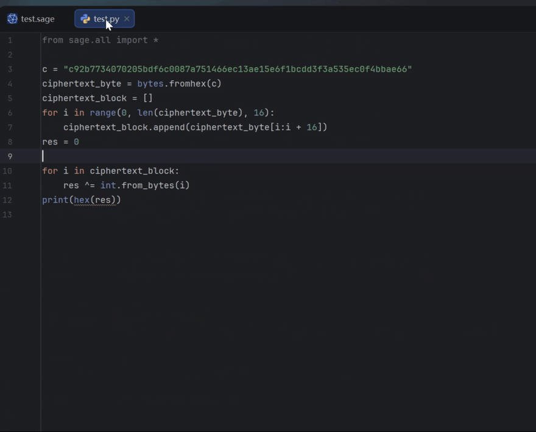

# Sage PyCharm Stubgen

[English](README.md) | [简体中文](README.zh-CN.md)

> Writing crypto Sage scripts? Stop switching to the source for every method
> name — completion and docs are right in the editor.



Generate and install static type stubs for SageMath so that PyCharm, Pyright,
Jedi, and other Python-aware editors can understand dynamic Sage APIs such as
`Mod`, `GF`, `PolynomialRing`, `matrix`, and `vector`.

**No PyCharm plugin is required.** The generated `.pyi` files are installed
next to the Sage runtime modules in the active Python environment, which makes
them visible to PyCharm's WSL interpreter indexer without adding a Sources
Root to every project.

Tested with SageMath 10.9 on Python 3.13 in WSL. The generator discovers the
installed Sage version at runtime instead of relying on a fixed symbol list.

## Quick start

Inside the Sage environment (WSL / native / Docker), run:

```bash
python -m pip install sage-pycharm-stubgen
sage-pycharm-stubgen --install     # generates and installs the .pyi stubs
```

Then point PyCharm at that Sage interpreter (WSL SDK): completion and
Ctrl+Q work in any project without extra Sources Roots, because the stubs
sit next to the runtime modules.  For first-class `.sage` files (generator
sugar, implicit `sage.all` namespace, run via the `sage` command), also
install the [sage-ide-support](https://github.com/starnotes-xj/sage-ide-support)
plugin.  Optional full-Chinese docs:
`sage-pycharm-stubgen translate-docs --apply-only`.

## What it fixes

SageMath exposes many objects dynamically and ships a large amount of compiled
Cython code. A static analyzer may therefore report errors such as:

```text
Cannot find reference 'Mod' in 'all'
Cannot find reference 'load' in 'persist'
```

It may also fail to complete methods returned by factories:

```python
from sage.all import Mod

x = Mod(5, 29)
x.sqrt(all=True)
```

This project:

- converts installed `.pyx` files, with matching `.pxd` declarations when
  possible, into `.pyi` files using
  [`stubgen-pyx`](https://github.com/jon-edward/stubgen-pyx);
- generates explicit exports for the dynamic `sage.all` module;
- infers importable return types for dynamic factories from the active Sage
  environment;
- falls back from Cython source parsing to conservative runtime reflection when
  an individual extension cannot be parsed;
- bridges base classes that stubgen-pyx drops for old-style Parent classes so
  inherited members (`__getitem__`, `_first_ngens`, ...) stay reachable;
- declares Sage-specific members that static analysis cannot discover
  (`FiniteField.characteristic`, `Integer` arithmetic operators,
  `CategoryObject._first_ngens`);
- enriches every stub with docstrings so PyCharm's Quick Documentation
  (Ctrl+Q) explains what a function returns -- including curated Chinese
  docs with verified examples for CTF-critical APIs such as `GF`,
  `from_integer`/`to_integer`, `log`, `discrete_log`, `CRT`, and `xgcd`;
- validates every generated stub before installation;
- preserves existing Sage-owned or user-owned `.pyi` files;
- tracks its own files in a manifest so updates and uninstallations only touch
  files owned by this tool, refuses downgrade installs from older tool
  versions, and prefers source-declared factory return annotations (Sage
  upstream PRs #42670/#42672) over runtime probing.

## Requirements

- SageMath installed in a Python/Conda environment
- Python 3.11 or newer
- PyCharm configured to use that same interpreter (WSL is supported)
- For first-class `.sage` files in PyCharm (dedicated file type, Sage sugar
  parsing, implicit `sage.all` namespace): the companion
  [sage-ide-support](https://github.com/starnotes-xj/sage-ide-support)
  plugin (PyCharm 2026.1+), which consumes the stubs installed here as its
  type-information data layer

Run all installation commands with Sage's Python interpreter. A normal Windows
Python installation cannot inspect a Sage environment installed in WSL.

The Chinese curated docs, the finite-field element-class return annotations,
and the downgrade protection ship since **0.7.0**; **0.8.0** adds the
opt-in machine-translation layer (a bundled shared cache plus the
`translate-docs` command below).

**Prefer English docs?** Run `sage-pycharm-stubgen --doc-language en
--install`: the curated Chinese docstrings are skipped (the original
English source docs stay) while every language-neutral type annotation is
still applied.

## Install

Inside the Sage environment:

```bash
conda activate sage
python -m pip install sage-pycharm-stubgen
sage-pycharm-stubgen --install
```

To install the current development version directly from GitHub instead, use:

```bash
python -m pip install "git+https://github.com/starnotes-xj/sage-pycharm-stubgen.git"
```

`--install` performs generation, strict validation, and installation in one
command. The generated build tree is stored at
`<current-environment>/sage_typings`, while the stubs used by the IDE are
placed beside the installed Sage modules, for example:

```text
<environment>/lib/pythonX.Y/site-packages/sage/all.pyi
<environment>/lib/pythonX.Y/site-packages/sage/misc/persist.pyi
```

The tool never overwrites `.py`, `.pyx`, or compiled extension files. It also
does not overwrite pre-existing `.pyi` files that it does not own.

## Configure PyCharm

1. Select the same WSL/Conda Python interpreter used above.
2. Remove any manually added `sage_typings` Sources Root from the project.
3. Refresh the interpreter package list.
4. If an old error remains cached, use **File → Invalidate Caches / Restart**.

The stubs then apply to every project using that interpreter. No custom
PyCharm plugin is needed for `.py` files. For first-class `.sage` files (own
file type, sugar-aware parsing, implicit `sage.all` namespace, typed
`F.<a> = GF(2^8)` completion), install the companion
[sage-ide-support](https://github.com/starnotes-xj/sage-ide-support) plugin;
alternatively, see [Preparsing Sage syntax](#preparsing-sage-syntax) for
converting Sage sugar to plain Python.

Press Ctrl+Q on any Sage function name to see its description, return type,
and examples (Chinese docs for 700+ common APIs); after a first install or
upgrade, use **File → Invalidate Caches / Restart** if the docs do not show
up.

## Configure VS Code

1. Install the official **WSL**, **Python**, and **Pylance** extensions.
2. Open the project in a WSL window, for example by running `code .` in Ubuntu.
3. Select the same Sage Python interpreter used to install the stubs.
4. Open a Python file and request completion after `x.` in the example above.

The generated stubs have been verified with Pyright 1.1.411: it resolves `x`
as `IntegerMod_abstract`, exposes the `sqrt` signature, and resolves
`sage.misc.persist.load` without errors. VS Code users do not need to install
the Pyright CLI separately when using Pylance.

Associating `*.sage` with the Python language can provide ordinary Python API
completion, but Pylance does not understand Sage preparser-only syntax such as
`R.<x> = PolynomialRing(...)`. Convert such files with the
[`preparse` command](#preparsing-sage-syntax) first.

## Update and uninstall

Run the same command after upgrading SageMath:

```bash
sage-pycharm-stubgen --install
```

Remove only the stubs owned by this tool:

```bash
sage-pycharm-stubgen --uninstall
```

If the environment already contains stale third-party `.pyi` files on the
same paths (older stub generators leave them behind), the installer
preserves them by default.  Take them over explicitly with
`--install --overwrite-unowned`; each replaced file is backed up as
`<name>.pyi.sps-bak` and restored by `--uninstall`.

The install manifest records the generator version.  Running `--install`
with an **older** tool version than the one that produced the current
stubs is refused — overwriting would silently lose the newer tool's
documentation enrichment (curated Chinese docs and return annotations).
Upgrade the tool (`pip install -U sage-pycharm-stubgen`) or pass
`--force` to bypass.  The curated Chinese doc table is also shipped next
to the installed stubs (`.sage-pycharm-stubgen-curated-docs.json`) as an
audit/recovery artifact.

## Preparsing Sage syntax

Sage's preparser sugar (`R.<x> = GF(2)[]`, `F.<a> = GF(2^8, ...)`, `^` as
power, `e^(-1)`) is only expanded in `.sage` files. A `.py` file using that
syntax is invalid Python, so PyCharm cannot parse it at all, let alone index
it. Convert a file to plain Python:

```bash
sage-pycharm-stubgen preparse test.py
```

The file is rewritten in place (atomically, keeping a
`test.py.preparse-backup` copy of the original). The conversion expands
generator declarations, powers, and numeric literals exactly as Sage itself
would, and inserts `from sage.all import *` when Sage symbols are used
without it — `.py` files do not get the implicit namespace injection that
`.sage` files receive from the Sage command.

Combined with the generated stubs, static analysis then resolves the
converted file end to end: `F` is typed as `FiniteField`, `a` and `x` come
from `_first_ngens`, and `from_integer`, `to_integer`, `polynomial`,
`characteristic`, and friends all complete. Verified with Pyright: zero
errors on a converted AES finite-field exercise.

Options:

- `--check` — only report files that still need conversion; exit code 1 if
  any do (useful in scripts and CI).
- `--output DIR` — write converted copies into `DIR` instead of rewriting in
  place.
- `--no-backup` — do not keep a `.preparse-backup` copy.

Several files can be converted at once:

```bash
sage-pycharm-stubgen preparse a.py b.py c.py
```

## Documentation enrichment

PyCharm's Quick Documentation reads the docstring *body* of a stub function,
so the generator repairs and fills docstrings during generation from three
sources, in priority order:

1. **Curated docs** (`supplemental_docs.py`) -- Chinese explanations with
   verified `sage:` examples and precise return annotations for 700+
   CTF-critical APIs (finite fields, polynomial rings, modular arithmetic,
   elliptic curves, matrices, number-theory tools), every example executed
   against the installed Sage before being written.  Regenerate the file
   with `python tools/build_supplemental_docs.py <research-output.json>`
   and merge new research with
   `python tools/merge_supplemental_docs.py <research-output.json>`.
2. **Source docstrings** -- extracted from the installed `.pyx` sources,
   including `cpdef`/`cdef` functions whose Cython return types upgrade
   `-> Any` where the stub's imports allow it.
3. **Runtime docstrings** -- the live Sage environment is imported module by
   module and `inspect.getdoc` fills what the sources leave out (inherited
   and decorator-built docstrings).  This import sweep takes minutes;
   disable it with `--no-runtime-docs`.

The pass also moves docstrings that stubgen-pyx emits as standalone string
statements *after* `def ...: ...` into the function body, which is the only
placement PyCharm's stub indexer associates with the function.

### Machine-translating the remaining docs (opt-in)

The curated layer covers the CTF-critical APIs; everything else keeps its
English source docstring.  To additionally translate **all** remaining
English docstrings into Chinese:

```bash
sage-pycharm-stubgen translate-docs --apply-only
```

This is an **explicit, opt-in command** — it never runs automatically
during `--install`, so English-only users are unaffected unless they invoke
it.  It applies every translation from two sources, merged together:

1. the **shared cache shipped inside the package** (the accumulated batch
   translation of the whole Sage API, ~12k docstrings — instant, no
   network needed; disable with `--no-bundled`), and
2. your own persistent cache (`~/.sage-pycharm-stubgen/translations.json`),
   which wins over the shipped one where they overlap.

Docstrings missing from both caches can be translated on demand with a
live backend (`--backend google`, or `--backend baidu` with
`BAIDU_APPID`/`BAIDU_API_KEY` env vars; `--workers N` parallelizes the
Baidu LLM requests).  Runs are resumable after interruptions, and
re-applying the cache is instant:

```bash
sage-pycharm-stubgen translate-docs
sage-pycharm-stubgen translate-docs --apply-only
```

Machine translations are readable but unverified; the curated entries
remain the only layer whose examples are executed against Sage.

## Advanced generation

To generate a small test subset without installing it:

```bash
sage-pycharm-stubgen \
  --pattern 'rings/finite_rings/integer_mod.pyx' \
  --output ./sage_typings_test
```

The output contains a `generation-report.json` and the generated `sage/` stub
tree. Factory inference details are written to
`sage/factory-inference.json`.

## Limitations

No static stub generator can promise one perfectly precise type for every
possible dynamic Python call. A function may choose its return type from
argument values, plugins, files, network state, or classes created at runtime.
This tool instead requires every detected factory to have an importable static
return type during strict installation. Factories with several implementations
use a common importable base class whose members are valid for the observed
implementations.

## Companion projects

- [sage-ide-support](https://github.com/starnotes-xj/sage-ide-support) — a
  PyCharm plugin giving `.sage` files first-class support: a dedicated "Sage"
  file type (Python dialect), transparent Sage generator-sugar parsing
  (`F.<a> = GF(2^8, ...)`), the runtime-injected `sage.all` namespace for
  static analysis, run configurations (native/WSL/Docker) and live templates.
  It consumes the `.pyi` stubs generated and installed by this tool; all type
  information and curated documentation live here, in the stub data layer.
- [JetBrains/intellij-community PR #3614](https://github.com/JetBrains/intellij-community/pull/3614) —
  a generic `typeInformationGenerator` extension point that lets PyCharm
  discover, invoke and refresh this engine for Sage interpreters
  (local/WSL/Docker).
- [sagemath/sage PR #42670](https://github.com/sagemath/sage/pull/42670) and
  [#42672](https://github.com/sagemath/sage/pull/42672) — upstream Sage
  annotations for the `GF`/`Zmod` factories and the `FiniteField`
  element-returning methods; once merged, this engine prefers those
  source-declared types over its runtime probing.

## Development

```bash
python -m pip install -e .
python -m unittest discover -s tests -v
python -m compileall -q src tests
```

## License

[GPL-3.0](LICENSE). Derivative works must remain open under the same
license, and the original copyright notice must be preserved.
